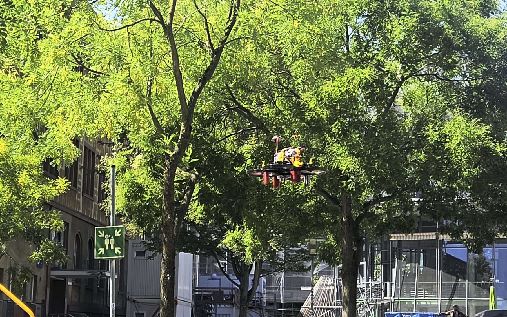

# Projektplakat

`plakat.html` ist die Quelle: eine einzelne HTML-Datei, gesetzt für **A1 hoch
(594 × 841 mm)**, ohne externe Abhängigkeiten. Daraus entstehen vier Druckstände:

| Datei | Format | Wofür |
|---|---|---|
| `plakat-a0.pdf` | 841 × 1189 mm | Messestand, Lesen aus mehreren Metern |
| `plakat-a1.pdf` | 594 × 841 mm | das Zielformat, für das die Schriftgrößen gewählt sind |
| `plakat-a2.pdf` | 420 × 594 mm | Bürowand, kleine Posterwand |
| `plakat-a3.pdf` | 297 × 420 mm | Handout und Korrekturausdruck |

Nur A1 wird gerendert; A0, A2 und A3 sind maßstäbliche Skalierungen derselben
Seite. Schrift und Grafik bleiben dabei vektoriell, nur das Foto ändert seine
effektive Auflösung: 261 dpi auf A1, 185 dpi auf A0, 523 dpi auf A3. Auf A3 ist
der kleinste Fließtext nur noch rund 2,5 mm hoch — als Handout lesbar, als
Aushang nicht.

## PDFs neu erzeugen

Zuerst A1 aus dem HTML rendern:

```bash
"/Applications/Google Chrome.app/Contents/MacOS/Google Chrome" --headless --disable-gpu --no-pdf-header-footer --print-to-pdf=docs/poster/plakat-a1.pdf "file://$PWD/docs/poster/plakat.html"
```

Dann die drei übrigen Formate daraus skalieren — reine Skalierung derselben
Seite, damit alle vier Druckstände garantiert denselben Satz zeigen. Das Skript
braucht `pypdf`, das `uv` hier nur für diesen einen Lauf beschafft:

```bash
cd docs/poster && uv run --with pypdf python skaliere_plakat.py
```

Der Inhalt von `skaliere_plakat.py` (bewusst nicht im Repository, damit keine
Abhängigkeit deklariert werden muss, die nur ein Druckvorgang braucht):

```python
from pypdf import PdfReader, PdfWriter, Transformation
from pypdf.generic import RectangleObject

MM = 72 / 25.4
QUELLE = (594.0, 841.0)                    # das Layout ist in A1 gesetzt
ZIELE = {"a0": (841.0, 1189.0), "a2": (420.0, 594.0), "a3": (297.0, 420.0)}

for name, (breite, hoehe) in ZIELE.items():
    seite = PdfReader("plakat-a1.pdf").pages[0]
    faktor = min(breite / QUELLE[0], hoehe / QUELLE[1])
    # Die DIN-Reihe rundet auf ganze Millimeter, sodass Breiten- und
    # Hoehenverhaeltnis minimal auseinanderfallen; den Rest mittig verteilen.
    dx = (breite - QUELLE[0] * faktor) / 2 * MM
    dy = (hoehe - QUELLE[1] * faktor) / 2 * MM
    seite.add_transformation(Transformation().scale(faktor).translate(dx, dy))
    kasten = RectangleObject((0, 0, breite * MM, hoehe * MM))
    seite.mediabox = kasten
    seite.cropbox = kasten
    schreiber = PdfWriter()
    schreiber.add_page(seite)
    schreiber.compress_identical_objects()
    for fertig in schreiber.pages:
        fertig.compress_content_streams(level=9)
    with open(f"plakat-{name}.pdf", "wb") as datei:
        schreiber.write(datei)
    print(f"plakat-{name}.pdf: {breite:.0f} x {hoehe:.0f} mm")
```

Alternativ im Browser öffnen und drucken: Papierformat wählen, Ränder **keine**,
Option **Hintergrundgrafiken** aktivieren, Skalierung „an Seite anpassen".

## Was auf dem Plakat steht

Linke Spalte Ziel, Hardware, Kennzahlen, Vorgehen und das Foto; mittlere Spalte
Systemarchitektur, Navigation ohne GPS, das Zwischenergebnis aus Tag-Erkennung
und Abwurf, Rahmen und Werkzeuge; rechte Spalte die Flugversuche, die drei
gemessenen Ursachen des Absturzes, der QR-Code zum Video, die Simulation, die
Konsequenzen im Code und der Ausblick.

Der **QR-Code** ist als Pfad-SVG direkt im HTML eingebettet (kein externer
Dienst, kein Bild-Asset) und zeigt auf das Video des Absturzes vom 21.08.2026.
Neu erzeugen lässt er sich mit `segno`; der Inhalt ist die reine URL.

## Fotos

`fotos/drohne-flug-quer.jpg` (1800 × 1125) steckt als **Abb. 1** im Kasten „Die
Drohne". `fotos/drohne-flug-hoch.jpg` ist derselbe Flug im Hochformat und wird
auf der Projektseite (`site/`) als Titelbild verwendet. Beide sind aus dem
Original `Bild.png` (3840 × 2160, um 90° gedreht) erzeugt.

Ein Foto tauschen heißt, im HTML das `img` im Kasten `.foto` zu ersetzen:

```html
<div class="foto foto-gross">
  
</div>
```

Das Bild wird formatfüllend zugeschnitten (`object-fit: cover`). Für den Druck
sollte es mindestens 1600 px breit sein.

## Quellen des Inhalts

Der Text stammt aus `docs/drone-project.md`, `docs/DRONE_CONFIGURATION.md`,
`docs/APRILTAG_MISSION.md`, `docs/FRAME_AND_3D_PRINTS.md`, dem
AprilTag-Durchsatztest in `state/2026-08-18/camera-apriltag-benchmark.json` und
dem Flugprotokoll in `state/2026-08-21/README.md`.
