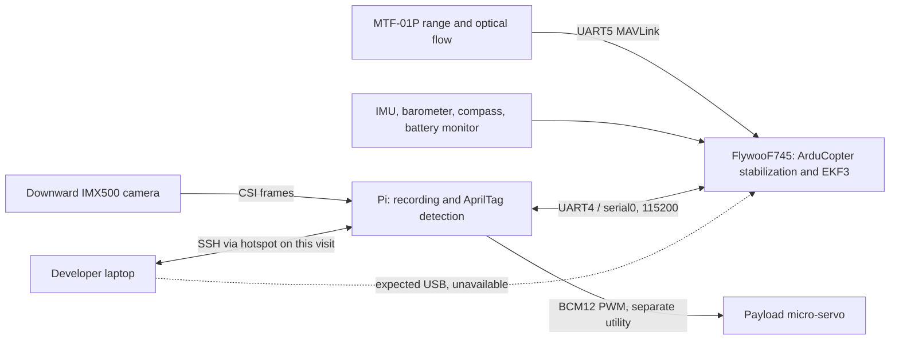

**Code review and live bench inspection — 7 September 2026**

**Consolidation update:** [repository, Pi deployment and networking cleanup](consolidation.md)
unifies development on `main`, preserves previous branch tips under archive
tags, and restores eduroam, USB SSH and the Pi's existing Tailscale identity.
The revised runtime passes 541 offline tests and two isolated simulator tests;
an 18:58 CEST disarmed Pi capture confirms camera, FC UART and downward range/flow.
The [19:15–19:18 CEST team-access follow-up](team-access.md) applies and verifies
the shared SSH policy, repairs the laptop's short SSH alias, and raises eduroam
above every other saved client network without an access-point lock.

**Repair update, 17:01 CEST:** [the MTF-01P and GPS-free EKF relative aiding are restored](indoor-repair.md). Five persistent FC settings were repaired and verified through reboot; all pre-arm checks are enabled again. The final repaired software is installed on the Pi; an 8-second disarmed recording verified camera/range/flow and battery 15.57–15.58 V. The Pi clock was corrected. The final offline suite passed 536 tests and both separate simulator tests passed. The MT-15 still has no FC receive data on normal or swapped UART3, and the compass fails its magnetic-field pre-arm check. See the repair report for code fixes, tests, firmware verification and remaining physical work.

**Earlier update, 15:46 CEST:** [FC USB and Pi↔FC UART communication are confirmed](fc-pi-mt15-confirmation.md), with battery16.132 V and the FC disarmed. Despite the separate successful direct-USB MT-15 setup, FC UART3 still receives zero bytes and RNGFND2 remains disabled. The current five-port MAVLink allocation excludes downward UART5, which is emitting valid MSP range/flow packets; FC range/flow health is currently false. No persistent settings were changed in this verification.

**Earlier update, 14:18 CEST:** [all seven FC UARTs were inspected](mt15-all-ports-recheck.md). USB works; the downward sensor sends valid range/flow packets; UART6 sends valid GPS data at230400 baud but GPS is disabled and has no fix. Forward MT-15 identification failed, including UART3 baud scanning and the vendor heartbeat. The supplied diagram suggests the reused analog VTX connector lacks the required RX3 connection. No persistent settings were changed. Battery telemetry fell to11.914 V, and powered checks ended.

**Earlier update, 13:49 CEST:** [direct USB communication is now verified](usb-connection-recheck.md) on `/dev/ttyACM0`, with the expected FlywooF745 serial identity. The FC is disarmed in STABILIZE; battery telemetry is now 12.626 V.

**Later update, 13:10–13:11 CEST:** the [connection and battery recheck](connection-battery-recheck.md) successfully reached the FC through the Pi UART and received sensor data. Battery voltage was 13.450–13.457 V. The live `ARMING_SKIPCHK=4` bypasses compass checks. The initial inspection below describes the earlier unavailable connection; use the linked recheck for the newer live state.

**Original inspection, 12:59–13:00 CEST (historical; superseded by the repairs above)**

The camera image-acquisition check passed. The flight controller could not be reached through either its expected direct USB connection or the Pi UART, so the FC-connected sensors could not be tested. The servo was not actuated: its GPIO is accessible, but there is no position feedback, no current FC heartbeat to establish disarmed state, and the requested confirmation of the physical bench conditions has not been received. These are incomplete checks, not evidence that those devices are defective.

The maintained code has several confirmed correctness problems, including actuator shutdown races and ambiguous arm/disarm cleanup. The new tag-triggered servo recorder containing the shutdown races is present in this checkout but **is not deployed on the Pi**. No production code, firmware, FC parameters, missions, calibration, Pi services, or actuator settings were changed during this review.

The reviewed repository HEAD is `6b9bacd46fc5c2c33f11b0a776d6a9a5e936c5db`. Scope covers the 35 maintained Python modules, associated tests, firmware integration, operational scripts, and project documentation. This is a functional and integration review, not a claim of exhaustive review of all upstream ArduPilot or third-party dependencies. Different-drone reference captures were not used.

**Live evidence**

The host observed a Raspberry Pi USB Ethernet gadget, but no ArduPilot USB device and no `/dev/ttyACM*` or `/dev/ttyUSB*` device. The host USB interface had `192.168.7.1/24`; the Pi later confirmed `usb0=192.168.7.2/24`. Nevertheless, ARP resolution failed and the host kernel repeatedly logged `cdc_ether NETDEV WATCHDOG` transmit timeouts. A multicast IPv6 probe returned only the host itself. Tailscale reported the Pi offline and SSH timed out.

The saved `AI-Drone-Zero` hotspot worked at `seb@192.168.4.1`. Each temporary host Wi-Fi change was followed by restoration of the original eduroam connection. The Pi's network configuration was not changed.

| Component | Result on this visit | What the result establishes |
| --- | --- | --- |
| Pi Zero 2 W | Reachable by hotspot; Python 3.13.5; about 23 GiB root storage free | The companion boots and runs the deployed tools |
| Pi power/temperature | `get_throttled=0x0` before and after capture; 47.8°C before, 52.6°C after | No reported undervoltage/throttling flags during this camera check; servo-load power remains untested |
| IMX500 camera | Enumerated; 300 captured/analyzed frames, 301 encoder timestamps over about 10.03 s; H.264 at 1280×960 | CSI acquisition, recording, and native detector processing ran at roughly 30 fps in this scene |
| Camera scene/focus | Preview is almost featureless light grey; no tags detected | Does not establish useful focus, optical geometry, or real printed-tag detection |
| IMX500 neural inference | Not exercised | The application uses CPU AprilTag processing, not an inference model on the camera accelerator |
| FC direct USB | No FC enumerated on repeated checks | The expected direct data connection was unavailable |
| FC Pi UART | No heartbeat at 115200 baud; a separate receive-only five-second check read **zero bytes** | The failure precedes MAVLink decoding; power, wiring, FC state, and connection need physical checking |
| Pi UART pin assignment | GPIO14=TXD0; GPIO15=RXD0; `/dev/serial0`→`ttyAMA0` | The expected Pi UART mux is present; it does not prove physical continuity |
| Gyroscope/accelerometer, barometer, compass, battery monitor, EKF | No live FC data | Not tested on this visit |
| MTF-01P downward range and optical flow | No live FC data | Not tested on this visit; these streams normally arrive through the FC |
| GPS/RC | No live FC data | Not tested; the last project capture had GPS disabled and zero RC channels |
| Forward range sensor | No live evidence | Latest project documentation says no forward sensor is installed/configured; it should not be assumed present or working |
| Payload servo | GPIO12=input, low; no servo process observed; no PWM sent | The GPIO interface exists; servo presence, travel, load, and return position remain unverified |

The capture is under [the local recording directory](../../artifacts/sensor-recordings/review-20260907T105959Z/). Inspect the [manifest](../../artifacts/sensor-recordings/review-20260907T105959Z/manifest.json), [host time metadata](../../artifacts/sensor-recordings/review-20260907T105959Z/host-metadata.json), [first camera frame](../../artifacts/sensor-recordings/review-20260907T105959Z/first-frame.jpg), and [receive-only UART result](../../artifacts/sensor-recordings/review-20260907T105959Z/uart-passive-check.txt). Raw video and per-frame metadata remain in the ignored `artifacts/` tree rather than being committed.

The host bounded the main inspection between **2026-09-07 10:59:59 UTC and 11:00:37 UTC**. The Pi clock incorrectly reported **2026-09-01**, with `NTPSynchronized=no`. The Pi timestamps in the unmodified manifest and frame records must therefore not be used as the actual calendar date of this test. Monotonic capture timing still supports the measured duration and frame rate. The clock was observed, not set.

The deployed inspector returned exit code 0 while recording camera data and no FC data. This is its intentional partial-availability behavior; it does **not** mean that all sensors passed. Its safety section correctly records `initial_vehicle_state=unavailable`. No arm, disarm, flight-mode, motor, throttle, RC override, servo, mission-start, or parameter-write command was sent. Because no heartbeat arrived, this run did not even reach telemetry-rate requests.

The installed `/usr/local/sbin/ai-drone-network` and its service exist; the service is active/exited. A bare invocation in noninteractive SSH returned “command not found” because that shell did not find the sbin-installed helper. This is an invocation/PATH issue, not evidence of a missing installation. `NetworkManager-wait-online.service` was failed at inspection time. The exact USB transport fault remains undiagnosed.

**Photos and hardware-to-code mapping**

All four supplied parent-directory photographs were inspected. [Photo 4](../../../drone-image-4.jpeg) shows the downward camera in its housing, the adjacent range/flow module, and a blue micro-servo with a custom linkage. Photos 1–3 show the Pi on top, the camera ribbon, and the raised GPS/compass module. The photographs show propellers fitted; they do not establish the current bench condition, exact supply wiring, sensor alignment, or a calibrated mechanical travel range.

ArduCopter performs stabilization and sensor fusion. The Python companion does not implement the low-level attitude controller. The flight tool sends a bounded `GUIDED_NOGPS` climb, waits for flow-backed relative position, transitions to `LOITER`, then requests `LAND`. Its defaults include 0.5 m relative climb, a 0.8 m range-aligned ceiling, five seconds of Loiter, and a 14.4 V minimum battery guard. Firmware/parameter checks, sensor freshness, and FC failsafes support that path; they do not validate the actual airframe.

The vision pipeline records hardware-encoded video separately from lower-resolution CPU AprilTag analysis. Metric pose requires supplied camera calibration. The application does not yet implement the documented camera-to-body transform, closed-loop tag approach, centered/altitude-qualified release, or obstacle-aware search. The new active recorder triggers on qualified tag presence; it is not a precision-drop controller. The payload servo is connected to the Pi, so FC `SERVO_OUTPUT_RAW` cannot verify it.

The config tools download and validate complete parameter snapshots, while deployment distributes an allowlisted runtime. Network/power scripts provide separate provisioning and recovery behavior. The firmware overlay enables EKF optical-flow fusion and `GUIDED_NOGPS` in the pinned ArduCopter build. The latest recorded installation evidence is historical; the live firmware could not be reread today.

**Confirmed code findings to prioritize**

| Priority | Finding and effect | Relevant code |
| --- | --- | --- |
| Before active recorder use | A trigger can command the servo after disarm/stop has been observed. The stop checks and GPIO write are separated by synchronous logging, and the disarm path logs telemetry before closing the actuation gate. Reproduced with mocks. This recorder is currently absent from the Pi. | [record.py](../../ai_drone/cli/record.py), [tag_servo_record.py](../../ai_drone/cli/tag_servo_record.py); exact lines and reproductions in the vision review |
| Before active recorder use | Shutdown restores SIGTERM/SIGHUP handlers before rest/detach completes; Ctrl-C during shutdown can leave PWM attached and the process lock unclosed. Startup also lacks an encompassing cleanup boundary. | `tag_servo_record.py:855–880`, `record.py:1040–1540` |
| Before active recorder use | A queued tag can reach the actuator before its durable intent record is written; duration expiry can omit the stop reason. | `tag_servo_record.py:604–614`, `record.py:363–365` |
| Before autonomous flight use | A disarmed heartbeat received while arming clears the pending-arm ownership flag. A following link error can therefore skip cleanup despite an uncertain arm command. Reproduced with mocks. | [controller.py](../../ai_drone/flight/controller.py):308, 801, 182 |
| Before relying on cleanup confirmation | `disarm()` can return successfully using cached `is_armed=False`, without a newly received disarmed heartbeat. | `controller.py:875–889` |
| Before custom servo calibration | Asymmetric pulse bounds are mapped around a fixed 1500 µs center, whereas gpiozero maps across the full min/max interval. Bounds 900–2200 µs plus a requested 1500 µs produce 1550 µs. The default symmetric bounds avoid this bug. | [servo.py](../../ai_drone/cli/servo.py):64–96; active recorder reuses the conversion |
| Battery guard correctness | MAVLink's unknown voltage value `65535` is converted to 65.535 V and accepted as fresh, sufficient voltage. This protocol bug was reproduced; occurrence on this aircraft is unconfirmed. | `controller.py:361–365` |
| Trustworthy inspection results | Optical-flow quality 0 can still yield status `ok`; packet counts mix sources and can double-count range streams. A late PTS parsing failure can produce exit 1 with `completed=true,error=null` in the manifest. | `record.py:573–582`, `943–946`, `1554–1601` |
| Deployment/recovery | Connect and deploy use inconsistent default SSH config handling; the runtime allowlist omits the network selector/service; the single-radio boot policy conflicts with dual-radio hotspot setup. | [targets.py](../../ai_drone/link/targets.py), [deploy.py](../../ai_drone/link/deploy.py), [network scripts](../../scripts/) |
| Provisioning assurance | The autostart audit matches unit names and misses `drone-tag-servo-record.service`, yet claims no vehicle-control service is enabled. It is not proof of actual unsafe autostart on this Pi. | [setup-pi-power-resilience.sh](../../scripts/setup-pi-power-resilience.sh):272–280 |

The servo interpolation contract was checked against the [official gpiozero implementation](https://gpiozero.readthedocs.io/en/stable/_modules/gpiozero/output_devices.html#Servo). MAVLink battery sentinel semantics and relevant ArduCopter behavior were checked against the locally available pinned upstream sources.

Other findings include a public `hold_loiter()` method that misses a later mode departure (the CLI's separate monitor catches it), initial target selection that trusts the first heartbeat, camera reads without an application-level timeout, whole-recording failure on one bad calibrated pose, and config publication that can include unrelated changes staged concurrently. Each finding's scope, evidence, and suggested correction is in the detailed reviews below.

**Deployment and historical-state distinctions**

The Pi source download contained 34 Python files. Thirty match this checkout exactly. `cli/record.py`, `cli/servo.py`, `link/deploy.py`, and `recording.py` differ from HEAD but match their versions in commit `cf6642b`. `cli/tag_servo_record.py` and its entry point are absent. See the [file-by-file SHA-256 comparison](../../artifacts/sensor-recordings/review-20260907T105959Z/deployed-source-comparison.json). Findings in the new active recorder must not be confused with code currently installed on the Pi.

The last project state record, [25 August](../2026-08-25/README.md), documented working range/flow telemetry and a compass magnetic-field pre-arm failure. It also documented GPS disabled, zero RC channels, and no forward rangefinder. Those observations are not a current sensor-health result. Older inventory/procedure text that describes a forward MT-15 as connected conflicts with the more recent project record and should be reconciled. `CURRENT.MD` also calls active-recorder changes uncommitted even though they are now in Git history; its listed implementation defects still warrant attention.

**Validation and follow-up**

The four non-overlapping offline test batches completed with **418 passed and 1 skipped**. The skipped synthetic pose test needs OpenCV, which is not installed in this laptop's default environment. Ruff lint and formatting, all four import-boundary contracts, dependency checks, and `git diff --check` passed. Type checking failed at `record.py:1168` because `cv2` is unresolved in that environment; this is an unpassed check, not a clean type-check result. Tests use mocks for physical hardware and do not certify sensor calibration or actuator behavior.

Both pinned SITL integration tests passed in 108.57 seconds: normal hover and forced companion-process loss each led to LAND and disarm. Maximum simulated altitude was 0.520 m and maximum Loiter horizontal drift was 0.029 m. The tests ran in a separate network namespace containing only loopback, with no path to physical hardware. They disable the battery voltage threshold and use idealized simulated flow/range; they do not exercise the camera or servo. See [simulation results](simulation-results.md). Across the offline and simulator batches, the result is **420 passed, 1 skipped**. Simulation must remain distinct from a live FC, sensor, or servo check.

To complete the hardware check, restore a known data-capable FC USB connection or the FC-to-Pi UART link and verify the FC is powered. Then obtain a fresh disarmed heartbeat, board identity, health flags, and a short source-filtered sensor recording. The MTF-01P may require its separate regulated/flight-battery supply; absence of telemetry while unpowered is not a sensor failure. Evaluate flow quality and response over textured flooring and range changes at measured distances, not packet presence alone.

For servo movement, the existing bench procedure requires propellers removed, a secured frame, clear unloaded linkage, and a verified regulated supply/common ground. Establish a mechanism-specific safe pulse interval and observe a brief movement/return externally; software success cannot substitute for physical feedback. The initial request authorizes a servo test, but the physical conditions and safe travel values still have to be established. The movement test remains pending.

Detailed reviews: [flight and MAVLink](code-review-flight.md), [camera, AprilTags, recording, and servo](code-review-vision-servo.md), [deployment, config, networking, power, and firmware](code-review-deployment.md).
